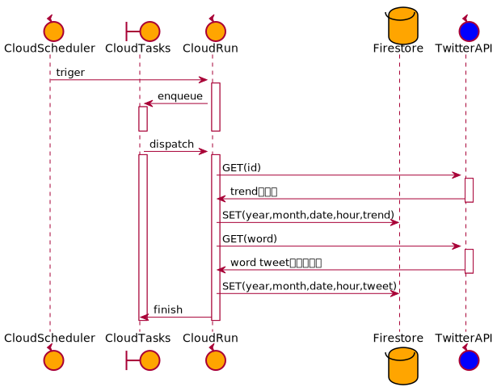
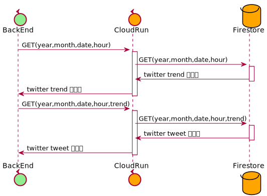

# tweet_collector

## 構成図

### batch

### 外部api


## セットアップ

### GCPのセットアップ

#### google-cloud-sdk

インストール

```
$ curl https://sdk.cloud.google.com | bash
$ exec -l $SHELL
```

初期化

```
$ gcloud init
```

アクセスの許可

```
$ gcloud auth application-default login
```

## Cloud Build & Cloud Run へのデプロイ

### Cloud Build

```
$ npm run build-image
```

### Cloud Run

GCPのGUIから行う